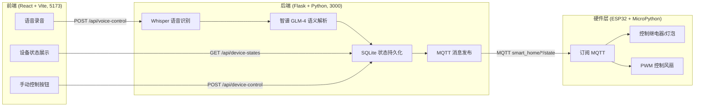
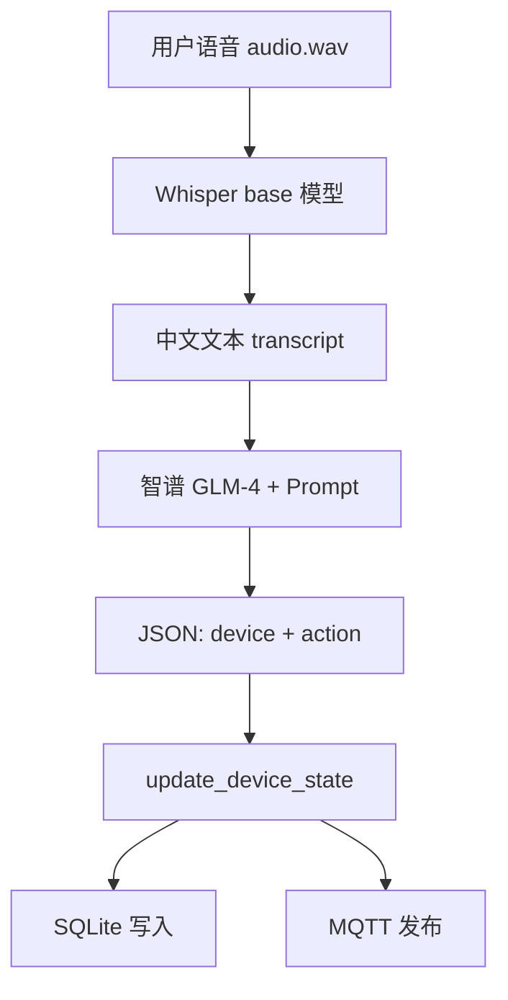
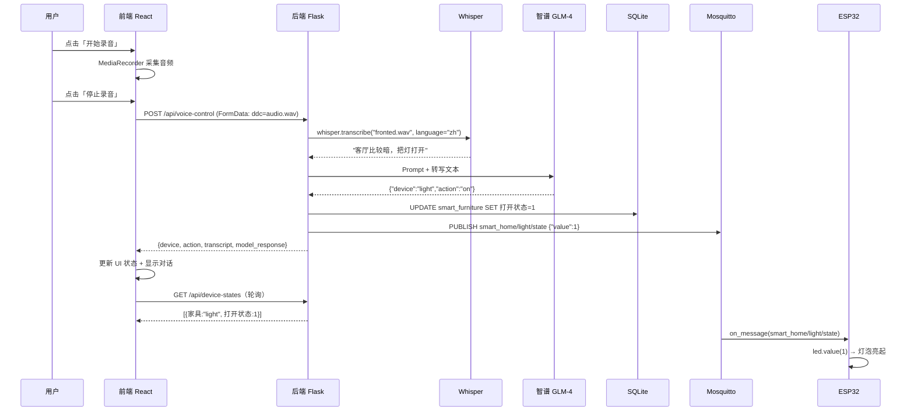

# 智能家居语音控制系统 — 毕业答辩讲解

> 基于语音大模型的智能家居控制系统设计与实现  
> 涵盖：前端（React）、后端（Flask）、硬件（ESP32）功能与实现详解

---

## 目录

1. [系统总体架构](#一系统总体架构)
2. [前端功能与实现](#二前端功能与实现详解)
3. [后端功能与实现](#三后端功能与实现详解)
4. [硬件后端（ESP32）](#四硬件后端esp32功能与实现)
5. [端到端数据流](#五端到端完整数据流)
6. [答辩常见问题](#六答辩可能被问到的要点)
7. [项目文件索引](#七项目文件对照表)

---

## 一、系统总体架构

本系统是一个**三层架构**的智能家居语音控制系统：



### 技术选型总结

| 层级 | 技术 | 作用 |
|------|------|------|
| 前端 | React 19 + TypeScript + Vite + Tailwind | 用户界面、录音、状态展示 |
| 语音识别 | OpenAI Whisper（`base` 模型） | 中文语音 → 文本 |
| 语义理解 | 智谱 GLM-4 大模型 | 自然语言 → 结构化 JSON 指令 |
| 后端框架 | Flask + flask-cors | REST API 服务 |
| 数据库 | SQLite + LangChain SQLDatabase | 设备状态持久化 |
| 物联网通信 | MQTT（Mosquitto + paho-mqtt） | 后端 → ESP32 指令下发 |
| 硬件 | ESP32 + MicroPython | 实际控制灯和风扇 |

### 启动顺序

| 顺序 | 服务 | 默认地址 | 启动命令 |
|------|------|----------|----------|
| 1 | 后端 Flask | http://127.0.0.1:3000 | `cd backend` → `python app.py` |
| 2 | 前端 Vite | http://127.0.0.1:5173 | `cd frontend` → `npm run dev` |
| 3 | MQTT Broker | 127.0.0.1:1883 | Mosquitto 服务 |
| 4 | ESP32 固件 | 局域网 | 烧录 `esp32.py` 并上电 |

---

## 二、前端功能与实现详解

前端代码集中在 `frontend/src/App.tsx`，采用**单文件多组件**结构，左侧导航切换三个功能模块。

### 2.1 三大功能模块

| 模块 | 功能 | 实现组件 |
|------|------|----------|
| **语音控制** | 录音 → 上传 → 显示转写与模型回复 | `VoiceControl` + `VoiceControlPanel` |
| **智能家具管理** | 只读展示各设备当前状态 | `SmartFurniturePanel` |
| **智能家具模拟** | 手动点击按钮控制设备 | `FurnitureSimulationPanel` |

导航定义：

```typescript
const projects = [
  { id: 'voice', label: '语音控制' },
  { id: 'furniture', label: '智能家具管理' },
  { id: 'simulation', label: '智能家具模拟' },
]
```

### 2.2 类型系统设计（TypeScript 约束）

前端用 TypeScript 严格定义设备与指令的数据结构，保证前后端字段一致：

```typescript
type DeviceKey = 'light' | 'fan' | 'curtain' | 'tv'
type VoiceAction = 'on' | 'off'
type VoiceCommand = { device: DeviceKey; action: VoiceAction }
type HomeState = {
  light: SwitchPower      // 0 | 1
  fan: SwitchPower
  curtain: CurtainState   // 'open' | 'closed'
  tv: SwitchPower
}
```

- `DeviceKey`：前端展示的 4 种设备（后端还支持 `air_conditioner`）
- `VoiceAction`：只有 `on` / `off` 两种动作
- `HomeState`：前端本地维护的设备状态快照

### 2.3 语音控制模块 — 核心实现

#### ① 浏览器录音（Web API）

使用浏览器原生 **MediaRecorder API** 采集麦克风音频：

```typescript
const start = async () => {-------定义一个叫 start 的异步函数。一般就是用户点击“开始录音”按钮时调用这个函数。

  const stream = await navigator.mediaDevices.getUserMedia({ audio: true })获取系统音频权限，浏览器会返回一个音频流 stream
  const recorder = new MediaRecorder(stream)把刚刚拿到的麦克风音频流 stream 交给 MediaRecorder，让它负责录音
  recorderRef.current = recorder 把录音器保存到 recorderRef.current 里面
  chunksRef.current = []. 每次开始录音前，清空之前保存的音频片段
  recorder.ondataavailable = (a) => chunksRef.current.push(a.data)当录音器产生音频数据片段时，把片段保存到 chunksRef 中
  recorder.start()  开始录音
}
```

**实现要点：**

- `getUserMedia({ audio: true })` 请求麦克风权限
- `MediaRecorder` 将音频流分块存入 `chunksRef`
- 用 `useRef` 保存 recorder/stream，避免 React 重渲染丢失引用

#### ② 停止录音后上传

```typescript
recorder.onstop = async () => {
  const blob = new Blob(chunksRef.current, { type: 'audio/wav' })1. 把录音过程中收集到的音频片段合并成一个完整音频文件
  const FD = new FormData()2. 创建 FormData，用于上传文件
  FD.append('ddc', blob, 'audio.wav')
  3. 把音频文件加入 FormData
  // ddc 是字段名，要和后端 request.files["ddc"] 对应
  // audio.wav 是上传给后端时显示的文件名
   4. 向后端语音控制接口发送 POST 请求
  const response = await fetch('/api/voice-control', {
    method: 'POST',5. 指定请求方式为 POST
    body: FD,6. 请求体是包含音频文件的 FormData
  })
}
```

**实现要点：**

- 录音停止时触发 `onstop` 回调
- 将音频块合并为 `Blob`，通过 `FormData` 以字段名 **`ddc`** 上传（与后端 `request.files["ddc"]` 对应）
- `fetch` 发到 `/api/voice-control`，由 Vite 代理到后端 3000 端口

#### ③ 解析后端返回并校验

```typescript
const data = await response.json()把后端返回的数据转换成 JSON 对象
const isValidDevice = ['light', 'fan', 'curtain', 'tv'].includes(data.device)判断后端返回的设备是否合法。这里isValidDevice的值是波尔值
const isValidAction = data.action === 'on' || data.action === 'off'限制动作只有开和关，如果不是就为false

if (isValidDevice && isValidAction) {只有当设备和动作合法时，才执行里面的代码
  onCommand({ device: data.device, action: data.action })更新前端设备状态管理
}
onConversation([. 更新前端对话记录，让页面显示用户说了什么、模型返回了什么
  { role: 'user', content: data.transcript ?? '（未识别到文本）' }, data.transcript 是语音识别出来的文本 ，如果没有识别到文本，就显示“未识别到文本”
  { role: 'assistant', content: data.model_response ?? JSON.stringify(data) },添加模型/系统消息data.model_response
])
```

**后端返回的 JSON 结构：**

```json
{
  "device": "light",
  "action": "on",
  "transcript": "客厅比较暗",
  "model_response": "{\"device\":\"light\",\"action\":\"on\"}"
}
```

| 字段 | 含义 |
|------|------|
| `device` | 目标设备 |
| `action` | 开关动作 |
| `transcript` | Whisper 转写的原文 |
| `model_response` | 大模型原始回复 |
浏览器录音
   ↓
生成音频文件
   ↓
上传到 Flask 后端
   ↓
后端 Whisper 转文字
   ↓
大模型解析成 device/action
   ↓
前端检查 device/action 是否合法
   ↓
更新页面状态和对话记录

### 2.4 设备状态同步（轮询机制）

前端每 **1 秒** 从后端拉取一次设备状态，保证界面与数据库一致：

```typescript
const syncDeviceStates = useCallback(async () => {
  const response = await fetch('/api/device-states')
  const payload = await response.json()
  const rows = payload?.data ?? []
  // 遍历 rows，更新 homeState
}, [])前端问后端：现在数据库里每个设备是什么状态？

useEffect(() => {
  syncDeviceStates()
  const timer = setInterval(syncDeviceStates, 1000)每隔 1000 毫秒，也就是每 1 秒，执行一次 syncDeviceStates
  return () => clearInterval(timer)当组件卸载时，清除这个定时器
}, [syncDeviceStates])
```

**为什么用轮询而不是 WebSocket？**

- 实现简单，适合毕业设计演示
- 1 秒间隔对智能家居场景足够
- 后端无需维护长连接

### 2.5 手动设备控制（乐观更新）

「智能家具模拟」模块点击按钮时，采用**乐观更新**策略：

```typescript
const handleDeviceControl = async (command) => {
  // 1. 先本地更新，UI 立即反馈
  applyLocalCommand(command)
  // 2. 通知后端写库 + 发 MQTT
  await fetch('/api/device-control', {
    method: 'POST',
    headers: { 'Content-Type': 'application/json' },后端看到这个请求头后，就知道要用 JSON 的方式解析数据
    body: JSON.stringify(command),把前端对象打包成后端能接收的 JSON 字符串。
  })
  // 3. 300ms 后再同步一次，兜底数据库写入延迟
  setTimeout(() => syncDeviceStates(), 300)
用户点击设备按钮后，
前端先立即更新页面状态，
然后把控制命令发送给后端，
后端写数据库并下发 MQTT，
最后前端再从数据库同步一次状态，保证最终一致。
}
```

### 2.6 Vite 开发代理

```typescript
// vite.config.ts
export default defineConfig({
  server: {
    port: 5173,
    proxy: {
      '/api': `http://127.0.0.1:3000`,代理的作用是：把前端请求自动转发给后端。因为前端运行在 5173 端口，后端运行在 3000 端口，如果直接请求可能会出现跨域问题
    },
  },
})
```

前端所有 `/api/*` 请求自动转发到 Flask 后端，解决开发环境跨域问题。

---

## 三、后端功能与实现详解

后端核心在 `backend/app.py`，承担**语音识别 → 语义解析 → 状态持久化 → MQTT 下发**四条链路。

### 3.1 初始化与配置

```python
# Whisper 模型缓存（解决 Windows 权限问题）
cache_dir = Path(__file__).resolve().parent / ".cache" 在当前后端项目目录下，准备一个 .cache 文件夹，用来存放 Whisper 模型缓存。
os.environ["XDG_CACHE_HOME"] = str(cache_dir)告诉 Whisper：以后模型缓存不要放到系统默认目录，而是放到项目里的 .cache 文件夹。

这样做的好处是：

可以避免 Windows 系统中因为默认缓存目录权限不足导致模型加载失败。

# SQLite 数据库
db_path = Path(__file__).resolve().parent / "smart_home.db" 这行代码用于指定 SQLite 数据库文件的位置。
langchain_db = SQLDatabase.from_uri(f"sqlite:///{db_path.as_posix()}")后端程序连接 smart_home.db，后面可以通过 langchain_db 读写数据库。

# 设备与动作白名单
SUPPORTED_DEVICES = {"light", "fan", "air_conditioner", "curtain", "tv"}
SUPPORTED_ACTIONS = {"on", "off"}
MQTT_HARDWARE_DEVICES = {"light", "fan"}  # 仅这两类会发 MQTT
```

| 配置项 | 含义 |
|--------|------|
| `.cache` | Whisper 模型缓存目录 |
| `smart_home.db` | SQLite 数据库文件 |
| `SUPPORTED_DEVICES` | 5 种逻辑设备 |
| `MQTT_HARDWARE_DEVICES` | 仅 `light` 和 `fan` 会真正发 MQTT |

MQTT 连接参数支持环境变量覆盖：

```python
MQTT_HOST = os.getenv("MQTT_HOST", "127.0.0.1")这行代码用于获取 MQTT 服务器地址。默认连接本机运行的 MQTT Broker。
MQTT_PORT = int(os.getenv("MQTT_PORT", "1883"))这行代码用于获取 MQTT 端口号。
MQTT_USERNAME = os.getenv("MQTT_USERNAME", "ddc")MQTT Broker的账号密码
MQTT_PASSWORD = os.getenv("MQTT_PASSWORD", "Ddc@2026mqtt!")
MQTT_TOPIC_PREFIX = os.getenv("MQTT_TOPIC_PREFIX", "smart_home")MQTT 主题前缀
```

### 3.2 数据库层

#### 表结构

```sql
CREATE TABLE IF NOT EXISTS smart_furniture (
    家具 TEXT PRIMARY KEY,
    打开状态 INTEGER NOT NULL DEFAULT 0,
    对应数值 INTEGER NOT NULL DEFAULT 0
);
```smart_furniture 表用来保存所有智能家具的当前状态，其中设备名称作为主键，打开状态表示设备开关情况，对应数值为后续扩展连续控制参数提供空间。

| 字段 | 类型 | 含义 |
|------|------|------|
| `家具` | TEXT（主键） | 设备英文名，如 `light` |
| `打开状态` | INTEGER | 0=关，1=开 |
| `对应数值` | INTEGER | 与打开状态同步（预留扩展） |

启动时自动建表并插入 5 种设备初始记录。

#### 状态更新函数（核心）

```python
def update_device_state(device, action, source="unknown"):
    if device not in SUPPORTED_DEVICES or action not in SUPPORTED_ACTIONS:先检查这个命令是不是系统允许执行的命令。
        append_state_change_log({...})  # 记录非法请求   append_state_change_log 是写日志函数。
        return

    status = 1 if action == "on" else 0

    # UPSERT：不存在则插入，存在则更新
    langchain_db.run("""
        INSERT INTO smart_furniture (家具, 打开状态, 对应数值)
        VALUES (?, ?, ?)
        ON CONFLICT(家具) DO UPDATE SET
            打开状态 = excluded.打开状态,
            对应数值 = excluded.对应数值;
    """)

    # 写审计日志
    append_state_change_log({...})写入审计日志。这次是记录正常状态变更。

    # 仅硬件设备发 MQTT
    if device in MQTT_HARDWARE_DEVICES:
        try:
            publish_device_state_to_mqtt(device, status)
        except Exception as e:
            # MQTT 失败不影响数据库，只记警告
            append_state_change_log({..., "mqtt_ok": False})
```

**设计亮点：**

1. **UPSERT**：`ON CONFLICT DO UPDATE`，幂等更新
2. **日志追踪**：每次变更写入 `device_state_changes.log`（JSONL 格式）
3. **MQTT 容错**：数据库更新与 MQTT 发布解耦，MQTT 失败不阻断主流程

### 3.3 MQTT 发布

```python
def publish_device_state_to_mqtt(device, status):  定义一个函数，专门负责把设备状态发给 ESP32
    topic = f"smart_home/{device}/state"  不同设备使用不同的 MQTT 主题，ESP32 根据主题判断要控制哪个设备。
    payload = json.dumps({   把设备状态打包成 JSON 格式，准备发送。
        "device": device,
        "action": "on" if status == 1 else "off",
        "value": status   ESP32 实际上主要根据 value 执行硬件动作。
    })
    client.publish(topic, payload=payload, qos=1, retain=False)这行代码向 MQTT Broker 发布消息。
  topic 是发布主题。
  payload 是消息内容。
  qos=1 表示至少送达一次。
retain=False 表示不保留历史消息。
    result.wait_for_publish(timeout=3)  # 等待 Broker 确认  这行代码表示等待消息发布完成，timeout=3 表示最多等待 3 秒
```

**MQTT 消息格式：**

| 项目 | 值 |
|------|-----|
| 主题 | `smart_home/light/state` 或 `smart_home/fan/state` |
| 载荷 | `{"device":"light","action":"on","value":1}` |
| QoS | 1（至少送达一次） |
| retain | False（避免 ESP32 重连吃到过期消息） |

### 3.4 API 接口详解

#### ① POST /api/voice-control — 语音控制（最核心）

完整处理链路：

```python
@app.route("/api/voice-control", methods=["POST"])
def voice_control():  注册一个语音控制接口，用来接收前端上传的音频。
    # 1. 检查 ffmpeg（Whisper 依赖）
    if shutil.which("ffmpeg") is None: 先检查语音识别依赖是否存在（ Whisper 在处理音频时依赖 ffmpeg）
        return jsonify(error="未检测到 ffmpeg"), 500

    # 2. 接收前端上传的音频
    data = request.files["ddc"]   从请求里拿到前端上传的录音文件。
    data.save("fronted.wav")  把上传的音频保存成 fronted.wav 文件

    # 3. Whisper 语音转文本
    model = whisper.load_model("base")  base 模型体积相对较小，适合毕业设计本地演示。

可以理解为：

启动语音识别模型，准备用它把音频转成文字。
    result = model.transcribe("fronted.wav", language="zh")["text"]

    # 4. 构造 Prompt，调用智谱 GLM-4
    prompt = f"""你是智能家居控制意图解析器。用户原话："{result}"..."""
    response = zhipuai.chat.completions.create(
        model="glm-4",
        messages=[{"role": "user", "content": prompt}],
    )
    glm_result = response.choices[0].message.content

    # 5. 清洗并解析 JSON
    clean_json = glm_result.replace("```json", "").replace("```", "").strip()
    control_data = json.loads(clean_json)

    # 6. 更新数据库 + 发 MQTT
    update_device_state(control_data["device"], control_data["action"], source="voice-control") 根据大模型解析结果，更新数据库，并在需要时通过 MQTT 控制硬件

    # 7. 返回完整结果给前端
    control_data["transcript"] = result
    control_data["model_response"] = glm_result
    return jsonify(control_data)  把设备、动作、转写文本、模型结果一起返回给前端。
```

**三层处理模型：**



**Prompt 工程设计（语义映射规则）：**

```
你是智能家居控制意图解析器。
用户原话："{transcript}"

输出要求：
1) 必须只返回 JSON，不要任何解释文字。
2) 字段必须且仅包含：
   - "device": 只能是 "light" | "fan" | "air_conditioner" | "curtain" | "tv"
   - "action": 只能是 "on" | "off"

语义映射规则（重点）：
- 与"亮度/光线"相关语义默认映射到 light。
- "比较暗/太暗/有点暗/光线不足/看不清" -> device="light", action="on"
- "比较亮/太亮/有点亮/太刺眼/晃眼" -> device="light", action="off"
- 若用户明确提到具体设备（如风扇、窗帘、电视），优先按明确设备解析。

示例：
- "客厅比较暗" -> {"device":"light","action":"on"}
- "现在太亮了" -> {"device":"light","action":"off"}
- "把风扇打开" -> {"device":"fan","action":"on"}
```

**语义层输出的 JSON 结构：**

```json
{
  "device": "light",
  "action": "on"
}
```

**JSON 解析容错：**

```python
try:
    control_data = json.loads(clean_json)
except json.JSONDecodeError:
    control_data = {"device": None, "action": None, "parse_error": "invalid_json"}
```

大模型偶尔返回非标准 JSON 时，不会直接 500 崩溃。

#### ② GET /api/device-states — 查询设备状态

```python
@app.route("/api/device-states", methods=["GET"])
def device_states():
    return jsonify(data=fetch_device_states())  
```

遍历 5 种设备，从 SQLite 查询并返回数组，供前端轮询。

**返回示例：**

```json
{
  "data": [
    {"家具": "light", "打开状态": 1, "对应数值": 1},
    {"家具": "fan", "打开状态": 0, "对应数值": 0},
    {"家具": "air_conditioner", "打开状态": 0, "对应数值": 0},
    {"家具": "curtain", "打开状态": 0, "对应数值": 0},
    {"家具": "tv", "打开状态": 0, "对应数值": 0}
  ]
}
```

#### ③ POST /api/device-control — 手动控制

```python
@app.route("/api/device-control", methods=["POST"])
def device_control():
    payload = request.get_json()
    device = payload.get("device")
    action = payload.get("action")
    if device not in SUPPORTED_DEVICES or action not in SUPPORTED_ACTIONS:
        return jsonify(error="非法设备或动作"), 400
    update_device_state(device, action, source="device-control")
    return jsonify(ok=True, device=device, action=action)
```

前端「智能家具模拟」模块按钮点击时调用，走与语音控制相同的状态更新链路。

**请求体：**

```json
{"device": "light", "action": "on"}
```

#### ④ POST /api/mqtt/sync-light / sync-fan — MQTT 状态同步

```python
@app.route("/api/mqtt/sync-light", methods=["POST"])
def sync_light_to_mqtt():
    # 从数据库读取 light 当前状态
    status = query_light_status_from_db()
    publish_device_state_to_mqtt("light", status)
    return jsonify(ok=True, device="light", value=status)
```

**用途：** ESP32 上电重连 MQTT 后，主动请求后端按数据库最新值重发，避免吃到 Broker 上的历史 retain 旧消息。

### 3.5 CORS 跨域配置

```python
CORS(app, resources={r"/api/*": {"origins": ["http://localhost:5173", "http://localhost:5174"]}})
```

允许前端开发服务器跨域访问 API。

---

## 四、硬件后端（ESP32）功能与实现

硬件代码在 `backend/esp32.py`，使用 **MicroPython** 运行在 ESP32 上。

### 4.1 硬件接线

```python
LIGHT_PIN = 2    # GPIO2 → 继电器 → 灯泡
FAN_PIN = 5      # GPIO5 → PWM → 风扇模块

led = Pin(LIGHT_PIN, Pin.OUT)
fan_pwm = PWM(Pin(FAN_PIN, Pin.OUT), freq=1024)
```

| 引脚 | 控制方式 | 外设 |
|------|----------|------|
| GPIO2 | 数字输出 `Pin.OUT` | 继电器模块 → 灯泡 |
| GPIO5 | PWM 调占空比 | 风扇模块 |

### 4.2 网络连接

```python
def connect_wifi():
    wlan = network.WLAN(network.STA_IF)
    wlan.active(True)
    wlan.connect(WIFI_SSID, WIFI_PASSWORD)
    # 最多重试 20 次，每次间隔 1 秒
```

ESP32 作为 **Wi-Fi Station** 接入与 PC 同一局域网的路由器。

### 4.3 MQTT 订阅与消息处理（核心）

```python
def on_message(topic, msg):
    data = ujson.loads(msg)
    value = int(data.get("value", 0))

    if topic == b"smart_home/light/state":
        led.value(1 if value == 1 else 0)       # 继电器吸合/断开

    elif topic == b"smart_home/fan/state":
        duty = 420 if value == 1 else 0         # PWM 占空比
        fan_pwm.duty(duty)
```

**消息处理逻辑：**

- 订阅 `smart_home/light/state` 和 `smart_home/fan/state`
- 收到 JSON 后解析 `value` 字段
- **灯**：`value=1` → GPIO 高电平（继电器吸合，灯亮）
- **风扇**：`value=1` → PWM 占空比 420（高速）；`value=0` → 占空比 0（停止）

### 4.4 上电同步机制

```python
def request_backend_sync():
    for path in ("/sync-light", "/sync-fan"):
        url = f"http://192.168.0.3:3000/api/mqtt{path}"
        urequests.post(url)
```

ESP32 连上 MQTT 后，主动 HTTP 请求后端 `sync-light` / `sync-fan` 接口，让后端把数据库最新状态重新发布到 MQTT。

### 4.5 主循环与断线重连

```python
def main():
    wlan = connect_wifi()
    client = create_mqtt_client()
    request_backend_sync()

    while True:
        client.ping()           # 15 秒心跳保活
        client.check_msg()      # 非阻塞检查消息
        time.sleep_ms(200)
        # 异常时：重连 Wi-Fi → 重建 MQTT → 重新同步
```

---

## 五、端到端完整数据流

以用户说 **「客厅比较暗，把灯打开」** 为例：



### 时间线

| 阶段 | 耗时 | 说明 |
|------|------|------|
| 用户录音 | 2–5 秒 | 前端 MediaRecorder |
| Whisper 转写 | 2–3 秒 | 后端本地推理 |
| GLM-4 语义解析 | 1–2 秒 | 调用智谱 API |
| 数据库 + MQTT | <100ms | 后端本地操作 |
| ESP32 执行 | <200ms | 硬件响应 |
| 前端轮询刷新 | 最多 1 秒 | 定时拉取状态 |

---

## 六、答辩可能被问到的要点

### Q1：为什么用 Whisper 而不是百度/讯飞 API？

- **开源免费**，本地部署，不依赖外部 API 额度
- `base` 模型在中文场景下准确率足够
- 论文可强调「端到端深度学习语音识别」

### Q2：为什么用大模型做语义解析，不用规则/正则？

- 自然语言多样：「太暗了」「看不清」「光线不足」都能映射到开灯
- Prompt 工程可灵活扩展设备和场景
- 体现「大模型 + 物联网」的创新结合

### Q3：数据库为什么用 SQLite 而不是 MySQL？

- 轻量、零配置，适合单机演示
- LangChain `SQLDatabase` 可直接对接
- 毕业设计规模足够

### Q4：MQTT 为什么选 QoS=1？

- 保证消息至少送达一次
- 智能家居控制不允许丢指令
- `retain=False` 避免 ESP32 重连吃到过期消息

### Q5：前端为什么用轮询而不是 WebSocket？

- 实现简单，1 秒轮询对演示足够
- 后端无需维护连接状态
- 可说明「后续可升级为 WebSocket/SSE」

### Q6：如果大模型返回了非法 JSON 怎么办？

- `json.loads` 有 try-except 兜底
- 返回 `parse_error: "invalid_json"`，前端不更新设备
- `device_state_changes.log` 记录每次变更来源，便于排查

### Q7：空调/窗帘/电视没有硬件怎么控制的？

- 后端 `SUPPORTED_DEVICES` 包含 5 种，数据库都会更新
- 只有 `light` 和 `fan` 在 `MQTT_HARDWARE_DEVICES` 里，会发 MQTT
- 其余设备仅软件模拟（前端展示状态变化）

### Q8：系统的创新点是什么？

1. **语音 + 大模型 + 物联网**三层融合：Whisper 转写 + GLM-4 语义理解 + MQTT 硬件控制
2. **语义映射 Prompt 工程**：支持间接表达（「太暗了」→ 开灯），而非死板关键词匹配
3. **乐观更新 + 轮询同步**：前端体验流畅，状态最终一致
4. **ESP32 上电同步机制**：避免 MQTT retain 消息导致的状态不一致

### Q9：系统有哪些不足和后续改进方向？

| 不足 | 改进方向 |
|------|----------|
| 轮询有 1 秒延迟 | 升级为 WebSocket / SSE 推送 |
| 仅支持 on/off | 扩展亮度、风速、温度等连续参数 |
| 大模型偶发非 JSON | 增加 JSON Schema 约束或 Function Calling |
| API Key 硬编码 | 改为环境变量管理 |
| 无用户认证 | 增加登录与权限控制 |

---

## 七、项目文件对照表

| 文件 | 职责 |
|------|------|
| `frontend/src/App.tsx` | 前端全部 UI 与业务逻辑 |
| `frontend/vite.config.ts` | 开发代理配置 |
| `frontend/README.md` | 前端启动说明 |
| `backend/app.py` | 后端 API + Whisper + 大模型 + MQTT |
| `backend/esp32.py` | ESP32 固件（Wi-Fi + MQTT + GPIO/PWM） |
| `backend/smart_home.db` | SQLite 设备状态库 |
| `backend/device_state_changes.log` | 状态变更审计日志 |
| `backend/requirements.txt` | Python 依赖清单 |
| `backend/mosquitto_passwd.txt` | MQTT Broker 认证 |
| `README.md` | 项目总览与 API 列表 |

---

## 附录：现场演示脚本

### 演示前检查

1. Mosquitto 已启动（端口 1883）
2. 后端 `python app.py` 运行在 3000 端口
3. 前端 `npm run dev` 运行在 5173 端口
4. ESP32 已上电并连上 Wi-Fi + MQTT
5. 浏览器打开 http://127.0.0.1:5173

### 演示步骤

| 步骤 | 操作 | 预期效果 |
|------|------|----------|
| 1 | 切换到「语音控制」页 | 显示录音按钮和对话区 |
| 2 | 点击「开始录音」，说「客厅比较暗」 | 按钮变为「录音中...」 |
| 3 | 点击「停止录音」 | 对话区显示转写文本和模型回复 |
| 4 | 观察「智能家具管理」页 | 客厅灯状态变为「开」 |
| 5 | 观察 ESP32 硬件 | 灯泡实际亮起 |
| 6 | 切换到「智能家具模拟」页 | 点击「关」按钮，灯灭 |
| 7 | 说「把风扇打开」 | 风扇 PWM 启动 |

### 备用话术

- 「系统采用 Whisper 开源模型完成中文语音转写，再通过智谱大模型将自然语言解析为结构化控制指令。」
- 「后端将指令写入 SQLite 数据库，同时通过 MQTT 下发到 ESP32，实现软件状态与硬件动作的同步。」
- 「前端采用乐观更新策略，用户操作后界面立即响应，同时通过轮询保证与后端数据一致。」

---

*文档生成时间：2026 年 5 月*
